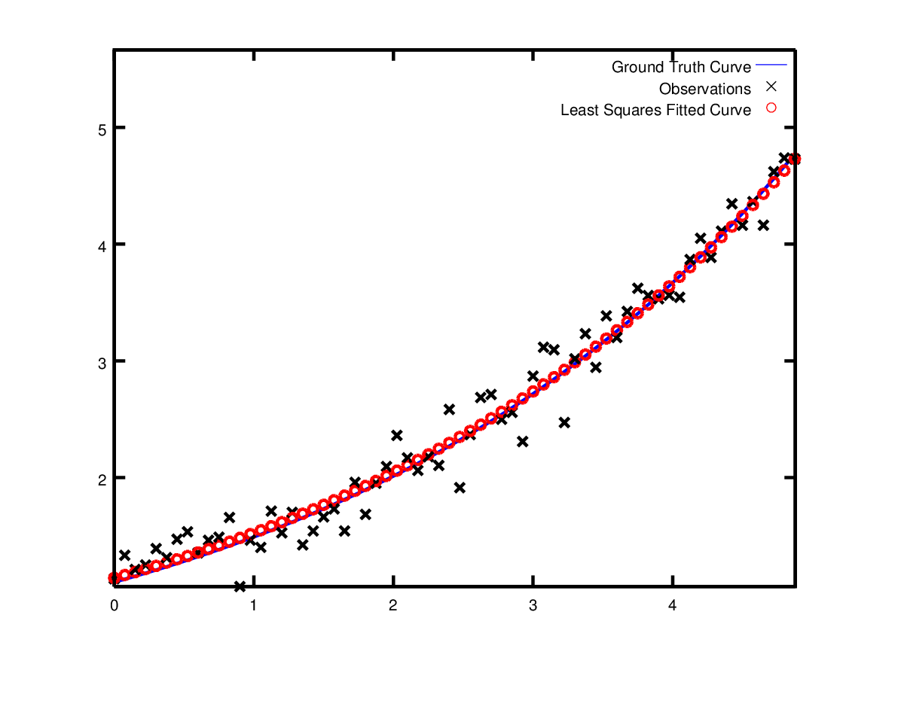

# Ceres Tutorial
As with all nonlinear-optimizers they can be difficult to master, in the following we give examples on how to effectively implement custom cost functions in Ceres-Solver. In particular we will cover several different topics:

- How do I define a cost function?
- How do I define the optimization problem?
- How do I define a numerical cost function?
- How do I define an analytical cost function?
- How do I load the optimization data?

## How do I define a cost function?
Ceres solves non-linear least squares problems of the form:

\begin{equation}
  \min_{\vec{\beta}} \dfrac{1}{2} \sum_{i = 1}^{m} r_{i}^{2} \\
  r_{i} = d_{i} - f(x_{i}, \vec{\beta})
\end{equation}

Where $m$ is a set of data points, and function $f(x, \vec{\beta})$ that takes in input variable $x$ and $n$ parameters $\vec{\beta} = (\beta_1, \beta_2, \dots, \beta_n)$ with $m \geq n$. In the nonlinear least squares problem we seek to find the vector $\vec{\beta}$ that minimizes the residual $r$ between function $f(\cdot)$ output and desired output $d$ for every data point $i$.

**Example** consider the problem of finding the minimum of the function:

\begin{equation}
  \dfrac{1}{2} (10 - x)^{2}
\end{equation}

**Important**: In Ceres a cost function is not really a cost function in the mathematical sense, what you as the user is implementing is infact the residual because the cost function is always contructed the same way ($\text{cost} = \sum \text{residuals}^{2}$), in this case it is:

\begin{equation}
  r = (10 - x)
\end{equation}

The minimum is located at $x = 10$ and in Ceres **this is what you are going to implement**, like so:

    struct CostFunctor {
      template <typename T>
      bool operator()(const T* const x, T* residual) const {
        residual[0] = T(10.0) - x[0];
        return true;
      }
    };

Keypoints to the example code:

- In Ceres a cost function implementation is a functor (function objects: a plain old C++ object plus the `()` operator), this is essentially so that the ceres solver can call your cost function with the overridded `()` operator you implemented. This is where you will add your custom residual function, for more information on functors see [this][stack_overflow-functors].
- It is **important to note in Ceres we only define the residual** when implementing the cost functor, because the cost function always is constructed the same way ($\text{cost} = \sum \text{residuals}^{2}$).
- The output of your cost function is written to `residual[0]`, in all cases `residual` is always an array of type `T`, further in this example we are only writing to `residual[0]` because the output dimension for our scalar cost function is 1.
- `x[0]` is of size 1 for this problem because the dimension of `x` is 1.
- The `operator()` is a templated method, which assumes that all its inputs and outputs are of some type `T`. The use of templating here allows Ceres to call `CostFunctor::operator<T>()`, with `T=double` when just the value of the residual is needed, and with a special type `T=Jet` when the Jacobians are needed.
- Because of the special `Jet` type that Ceres uses, one cannot pass in `Eigen::Vector` or `Eigen::Matrix`, the type of template `T` has to be a C++ primitive.
- The functor can be implemented using a `struct` as above, or with `class` either will work (as we will see later).
- Since the cost function contains template code it has to reside in a header file.

## How do I define the optimization problem?
In the previous section we have showed how one defines a cost function, here we will describe how one uses the cost function by setting up the optimization problem in Ceres.

    // The variable to solve for with its initial value.
    double initial_x = 5.0;
    double x = initial_x;

    // Build the problem.
    ceres::Problem problem;

    // Set up the only cost function (also known as residual). This uses
    // auto-differentiation to obtain the derivative (jacobian).
    ceres::CostFunction *cost_function =
        new ceres::AutoDiffCostFunction<CostFunctor, 1, 1>(new CostFunctor);
    problem.AddResidualBlock(cost_function, NULL, &x);

    // Run the solver!
    ceres::Solver::Options options;
    ceres::Solver::Summary summary;

    options.linear_solver_type = ceres::DENSE_QR;
    options.minimizer_progress_to_stdout = true;
    Solve(options, &problem, &summary);

    std::cout << summary.BriefReport() << "\n";
    std::cout << "x : " << initial_x << " -> " << x << "\n";

Note that:

    ceres::CostFunction *cost_function
        = new ceres::AutoDiffCostFunction<CostFunctor, 1, 1>(new CostFunctor);
                               ^              ^        ^  ^
                               |              |        |  |
    Automatic Differentiation -+              |        |  |
    Your custom cost functor  ----------------+        |  |
    Dimension of residual -----------------------------+  |
    Dimension of x ---------------------------------------+

**Important**: In Ceres a cost function is not really a cost function in the mathematical sense, what you as the user is implementing is infact the residual because the cost function is always contructed the same way ($\text{cost} = \sum \text{residuals}^{2}$) (see "How do I define a cost function?" above).

The `ceres::AutoDiffCostFunction` takes our `CostFunctor` previously defined as input, automatically differentiates it and gives it a `ceres::CostFunction` interface.

Running the above code example gives us:

    iter      cost      cost_change  |gradient|   |step|    tr_ratio  tr_radius  ls_iter  iter_time  total_time
      0  4.512500e+01    0.00e+00    9.50e+00   0.00e+00   0.00e+00  1.00e+04       0    5.33e-04    3.46e-03
      1  4.511598e-07    4.51e+01    9.50e-04   9.50e+00   1.00e+00  3.00e+04       1    5.00e-04    4.05e-03
      2  5.012552e-16    4.51e-07    3.17e-08   9.50e-04   1.00e+00  9.00e+04       1    1.60e-05    4.09e-03
    Ceres Solver Report: Iterations: 2, Initial cost: 4.512500e+01, Final cost: 5.012552e-16, Termination: CONVERGENCE
    x : 0.5 -> 10

## How do I define a numerical cost function?
Defining a numerical cost function is just a matter of using `ceres::NumericDiffCostFunction`, for more info see this [doc][ceres-numerical_diff].

    ceres::CostFunction *cost_function
        = new ceres::NumericDiffCostFunction<MyScalarCostFunctor, CENTRAL, 1, 2, 2>(
            new MyScalarCostFunctor(1.0));                           ^     ^  ^  ^
                                                                     |     |  |  |
                                  Finite Differencing Scheme --------+     |  |  |
                                  Dimension of residual -------------------+  |  |
                                  Dimension of x -----------------------------+  |
                                  Dimension of y --------------------------------+

**Important**: In Ceres a cost function is not really a cost function in the mathematical sense, what you as the user is implementing is infact the residual because the cost function is always contructed the same way ($\text{cost} = \sum \text{residuals}^{2}$) (see "How do I define a cost function?" above).

## How do I define an analytical cost function?
The implementation for an analytical cost function is more involving compared to a numerical or automatic differentiated cost function. First we have to implement the analytical cost function using `ceres::SizedCostFunction`. **

    class AnalyticalCostFunction
      : public SizedCostFunction<1 /* number of residuals */,
                                 1 /* size of first parameter */> {
    public:
      virtual ~AnalyticalCostFunction() {}
      virtual bool Evaluate(double const * const * parameters,
                            double *residuals,
                            double **jacobians) const {
        double x = parameters[0][0];
        // f(x) = 10 - x.
        residuals[0] = 10 - x;

        // f'(x) = -1. Since there's only 1 parameter and that parameter
        // has 1 dimension, there is only 1 element to fill in the
        // jacobians.
        //
        // Since the Evaluate function can be called with the jacobians
        // pointer equal to NULL, the Evaluate function must check to see
        // if jacobians need to be computed.
        //
        // For this simple problem it is overkill to check if jacobians[0]
        // is NULL, but in general when writing more complex
        // CostFunctions, it is possible that Ceres may only demand the
        // derivatives w.r.t. a subset of the parameter blocks.
        if (jacobians != NULL && jacobians[0] != NULL) {
          jacobians[0][0] = -1;
        }
        return true;
      }
    };

**Important**: In Ceres a cost function is not really a cost function in the mathematical sense, what you as the user is implementing is infact the residual because the cost function is always contructed the same way ($\text{cost} = \sum \text{residuals}^{2}$) (see "How do I define a cost function?" above).

Keypoints:

- Instead of overriding the `()` operator, with a `SizedCostFunction` we override the `Evaluate()` method.
- `parameters` contains all the data for the cost function.
- The jacobian for the cost function should be calculated when `jacobians` is not `NULL`
- Dimensions for residuals and parameters are now defined in the inherited class typecast

After defining the cost function to use it you simply do:

    ceres::CostFunction *cost_function = new AnalyticalCostFunction;

## How do I load the optimization data?
The examples we have seen until now are simple optimization problems with no data. The original purpose of least squares and non-linear least squares analysis was fitting curves to data. It is only appropriate that we now consider an example of such a problem. Lets consider a new cost function:

\begin{equation}
    y = e^{mx + c}
\end{equation}

We can implement the cost functor for the above cost function as:

    struct CurveFittingResidual {
      CurveFittingResidual(double x, double y)
          : x(x), y(y) {}

      template <typename T>
      bool operator()(const T* const m, const T* const c, T* residual) const {
        residual[0] = T(this->y) - exp(m[0] * T(this->x) + c[0]);
        return true;
      }

    private:
      // Observations for a sample.
      const double x;
      const double y;
    };

The key-point to note is we are using the private `x` and `y` member variables to store an observation. Assuming the observations are in a `2n` sized array called `data` the problem construction is a simple matter of creating a `ceres::CostFunction` for every observation.

    double m = 0.0;
    double c = 0.0;

    ceres::Problem problem;
    for (int i = 0; i < kNumObservations; ++i) {
      ceres::CostFunction* cost_function =
          new ceres::AutoDiffCostFunction<CurveFittingResidual, 1, 1, 1>(
              new CurveFittingResidual(data[2 * i], data[2 * i + 1]));
      problem.AddResidualBlock(cost_function, NULL, &m, &c);
    }

Running the above code would yeild:

    iter      cost      cost_change  |gradient|   |step|    tr_ratio  tr_radius  ls_iter  iter_time  total_time
      0  1.211734e+02    0.00e+00    3.61e+02   0.00e+00   0.00e+00  1.00e+04       0    5.34e-04    2.56e-03
      1  1.211734e+02   -2.21e+03    0.00e+00   7.52e-01  -1.87e+01  5.00e+03       1    4.29e-05    3.25e-03
      2  1.211734e+02   -2.21e+03    0.00e+00   7.51e-01  -1.86e+01  1.25e+03       1    1.10e-05    3.28e-03
      3  1.211734e+02   -2.19e+03    0.00e+00   7.48e-01  -1.85e+01  1.56e+02       1    1.41e-05    3.31e-03
      4  1.211734e+02   -2.02e+03    0.00e+00   7.22e-01  -1.70e+01  9.77e+00       1    1.00e-05    3.34e-03
      5  1.211734e+02   -7.34e+02    0.00e+00   5.78e-01  -6.32e+00  3.05e-01       1    1.00e-05    3.36e-03
      6  3.306595e+01    8.81e+01    4.10e+02   3.18e-01   1.37e+00  9.16e-01       1    2.79e-05    3.41e-03
      7  6.426770e+00    2.66e+01    1.81e+02   1.29e-01   1.10e+00  2.75e+00       1    2.10e-05    3.45e-03
      8  3.344546e+00    3.08e+00    5.51e+01   3.05e-02   1.03e+00  8.24e+00       1    2.10e-05    3.48e-03
      9  1.987485e+00    1.36e+00    2.33e+01   8.87e-02   9.94e-01  2.47e+01       1    2.10e-05    3.52e-03
      10  1.211585e+00    7.76e-01    8.22e+00   1.05e-01   9.89e-01  7.42e+01       1    2.10e-05    3.56e-03
      11  1.063265e+00    1.48e-01    1.44e+00   6.06e-02   9.97e-01  2.22e+02       1    2.60e-05    3.61e-03
      12  1.056795e+00    6.47e-03    1.18e-01   1.47e-02   1.00e+00  6.67e+02       1    2.10e-05    3.64e-03
      13  1.056751e+00    4.39e-05    3.79e-03   1.28e-03   1.00e+00  2.00e+03       1    2.10e-05    3.68e-03
    Ceres Solver Report: Iterations: 13, Initial cost: 1.211734e+02, Final cost: 1.056751e+00, Termination: CONVERGENCE
    Initial m: 0 c: 0
    Final   m: 0.291861 c: 0.131439

Ceres finds a solution $m=0.291861,c=0.131439$with an objective function value of $1.05675$. These values are a bit different than the parameters of the original model $m=0.3,c=0.1$, but this is expected. When reconstructing a curve from noisy data, we expect to see such deviations. Indeed, if you were to evaluate the objective function for $m=0.3,c=0.1$, the fit is worse with an objective function value of $1.082425$. The figure below illustrates the fit.

[stack_overflow-functors]: http://stackoverflow.com/questions/356950/c-functors-and-their-uses
[ceres-numerical_diff]: http://ceres-solver.org/nnls_modeling.html#numericdiffcostfunction
