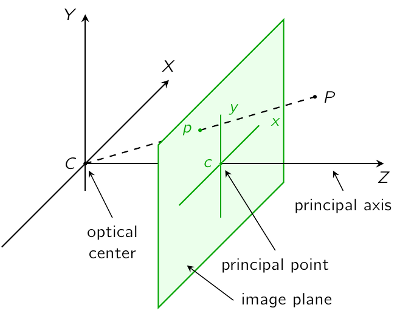

# Camera Models

## Pinhole camera model

The pinhole camera model is the easiest and most commonly used camera model.  It can include multiple parameters, including focal length, camera center pixel, skew, non-square pixels.  Additionally, radial distortion can easily be added to this linear model.

We wish to define a measurement model that explains how a pixels at location $(u,v)$ in the image, which correspond to point $(x,y)$ on the image plane, is illuminated by a point source in the $(X,Y,Z)$ position in the camera frame. Pixels are enumerated from the top left corner of the image, proceeding row-wise to the right, and then down through each row.  The camera frame is  defined as having its origin at the camera center, $x$-axis horizontal and to the right in the image plane, $y$-axis vertical and down in the image plane, and $z$-axis outward from the camera center to the world.

### Focal length model
The focal length defines the location of the image plane relative to the camera centre.  The image plane is often drawn in front of the camera center to eliminate the need to consider with the image inversion that results from the pinhole.  We first define the mapping from a 3D point in the camera frame to a 2D point on the image plane.

By similar triangles, the basic equations are,
\begin{eqnarray}
x & = & \dfrac{fX}{Z}
\end{eqnarray}
\begin{equation}
y = \dfrac{fY}{Z}
\end{equation}
which can be combined into homogeneous equation form as follows,
\begin{equation}
\left[\begin{array}{c} x \\ y \\ z \\ \end{array}\right]
 = \left[\begin{array}{cccc} f & 0 & 0 & 0\\ 0 & f & 0 & 0\\ 0 & 0 & 1 & 0 \\ \end{array}\right]
  \left[\begin{array}{c} X \\ Y \\ Z \\ 1 \\ \end{array}\right]
\end{equation}
Here $ w = Z $, so dividing the set of three equations by $Z$ yields the expected result.

### Adding camera center (principle point offset)

Pixels are numbered from the top-left corner of an image, and so the pixel counts must be adjusted to match the pinhole camera model with origin near the center of the image plane.  This can be done with a simple shift in the image plane, by $(x_0, y_0)$.

\begin{equation}
\left[\begin{array}{c} x \\ y \\ 1 \\ \end{array}\right]
 = \left[\begin{array}{ccc} f & 0 & x_0 & 0 \\ 0 & f & y_0 & 0 \\ 0 & 0 & 1 & 0 \\ \end{array}\right]
  \left[\begin{array}{c} X \\ Y \\ Z \\ 1 \\ \end{array}\right]
\end{equation}
